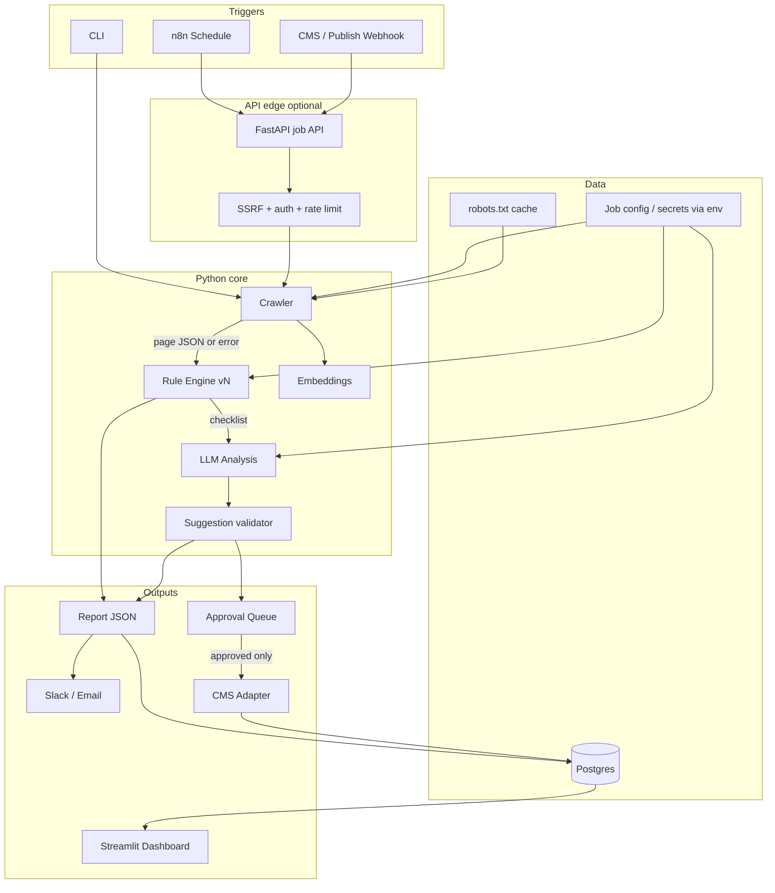
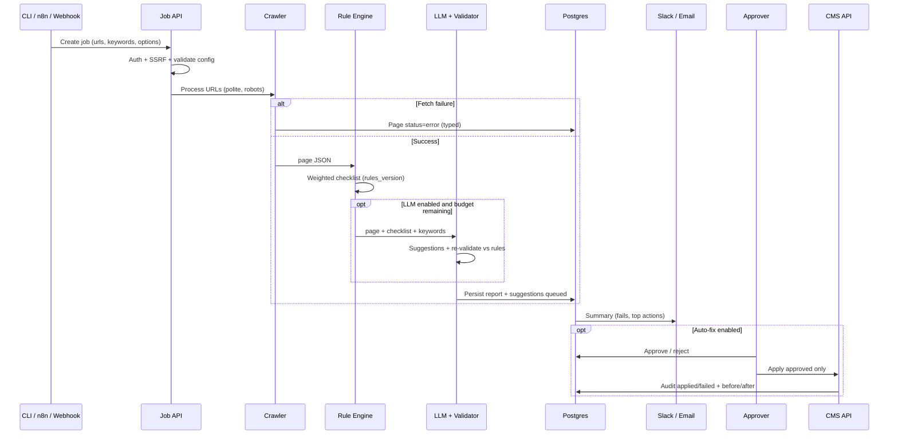
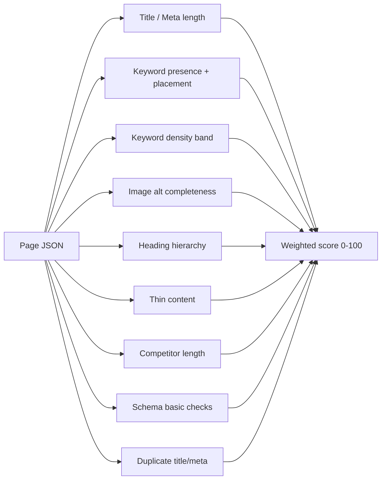
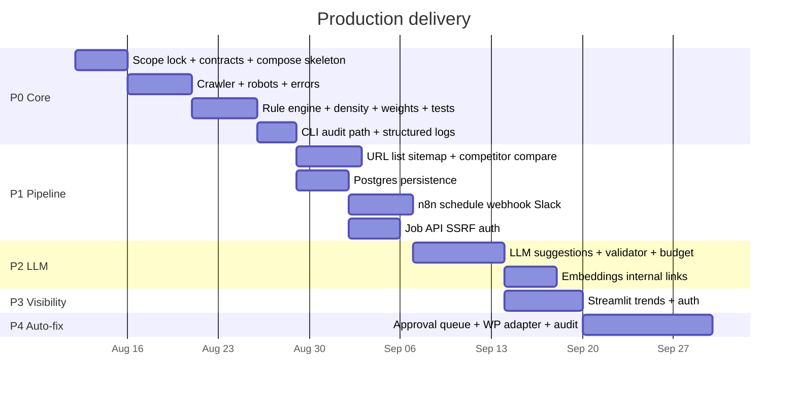
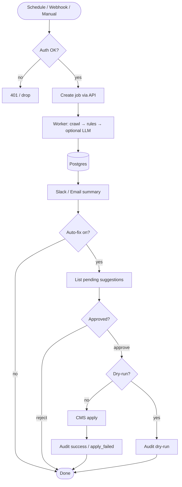

# On-Page SEO Automation System

Production-oriented architecture, feature set, and end-to-end implementation plan.

**Guiding principle:** ship a trustworthy core first (crawl → rules → report), then harden for production (reliability, security, observability, config), then add LLM / dashboard / CMS auto-fix behind approval gates. Never auto-publish LLM edits without human approval.

**Target:** a system you can run on a schedule against real sites, with predictable scores, audited changes, and safe failure modes — not a demo script.

---

## 1. Goal

Automate the full on-page SEO loop in production:

1. **Discover / fetch** pages (single URL → sitemap / URL list)
2. **Extract** on-page signals reliably (static + JS-rendered)
3. **Score** with deterministic, versioned rules
4. **Judge** ambiguous cases with an LLM (suggestions only; optional / budget-gated)
5. **Report** scores, gaps, and recommended fixes
6. **Track** history and regressions across runs
7. **Optionally apply** approved fixes via CMS API with full audit trail

### In scope (v1 production)

| Area | Capability |
|------|------------|
| Metadata | Title tags, meta descriptions |
| Structure | H1–H6 hierarchy, URL / canonical |
| Keywords | Presence, placement, **density band**, semantic coverage (LLM) |
| Media | Image alt text completeness + suggestions |
| Links | Internal / external extraction; **internal-link suggestions** when crawl corpus ≥ N pages |
| Content | Word count, thin-content threshold, readability, **length vs competitor sample** |
| Schema | JSON-LD / schema presence and basic validity |
| Ops | Schedule, notify, store, approve-to-publish |

### Out of scope (v1)

- Off-page SEO (backlinks), paid media
- Full technical SEO suites (CWV-only products, log-file analysis)
- Multi-tenant SaaS billing / white-label
- Auto-publishing without human approval
- Replacing Screaming Frog / Ahrefs / Semrush wholesale

---

## 2. Production Decisions (lock before build)

These are the Phase-1 decisions. Defaults below are production-sane; change only with a written reason.

| Decision | Production default | Notes |
|----------|-------------------|--------|
| First input mode | Single URL + URL list file | Sitemap crawl in P1 once single-URL path is stable |
| Keyword source | Manual keywords per URL/job in config/JSON | GSC adapter later behind the same interface |
| Primary CMS | WordPress REST API | Thin adapter interface so others can plug in |
| LLM provider | One provider via env (`OPENAI_API_KEY` or equivalent) | Direct HTTP client first; LangChain only if it stays thin |
| Orchestration | n8n for schedule / webhook / Slack | Business logic stays in Python |
| Storage | Postgres for production; SQLite allowed for local only | Same schema; driver switch via config |
| Dashboard | Streamlit internal (auth-protected) | Read-only against DB |
| Deployment | Docker Compose: `api` (Python), `db`, `n8n`, `dashboard` | One compose file for prod-like local + server |
| Approver | Human via Slack approve/reject or dashboard queue | No silent CMS writes |
| Crawl politeness | Honor `robots.txt`; default delay; max concurrency = 2 | Configurable per job |
| Success metric | Re-crawl after approved fix → rule score improves or stays; zero unapproved CMS writes | Track in run metadata |

**Open only if you must override:** target site list, Slack channel, exact LLM model name — put in env/config, not code.

---

## 3. Features to Build

Build in priority order. Production hardening starts in P0 (not deferred to “later”).

### P0 — Production core (one URL → scored report)

| Feature | What it does |
|--------|----------------|
| Job config | URL(s), keywords, thresholds, render mode, job id |
| Crawl with failure modes | HTTP errors, timeouts, soft-404 heuristics, empty body → structured error in report |
| `robots.txt` + politeness | Skip disallowed URLs; delay between requests |
| Static extract | BeautifulSoup: title, meta, headers, body, alts, links, canonical, schema |
| Playwright fallback | When configured or body below threshold / known JS |
| Rule engine | Versioned checklist (see §5); includes **keyword density band** |
| JSON + optional HTML summary | Machine report always; human summary optional |
| CLI entrypoint | `onpage-seo audit --url ... --keyword ...` |
| Config via env + YAML/JSON | No hardcoded secrets or thresholds |
| Structured logging | JSON logs: job_id, url, stage, duration_ms, status |
| Minimal tests | Rule scoring + one crawl fixture/self-check |
| SSRF protections | Block private/link-local IPs when URL input is untrusted (webhook/API) |

### P1 — Multi-page + pipeline

| Feature | What it does |
|--------|----------------|
| URL list / sitemap ingest | Cap max pages per job; resume-safe job status |
| Duplicate title/meta | Cross-page uniqueness |
| Competitor length compare | Optional competitor URL list → word-count delta vs target |
| Internal-link suggestions | Embeddings over crawl corpus (min pages threshold) |
| n8n workflow | Schedule + manual + webhook → Python → Slack/email |
| Idempotent jobs | Same job_id / content hash doesn’t double-write noisily |
| Rate limits / retries | Crawl + LLM + CMS with backoff |

### P2 — LLM judgment (budget-gated)

| Feature | What it does |
|--------|----------------|
| Semantic coverage | Related concepts, not only exact match |
| Suggestions | Title, meta, alt; **re-validated against rules** before queue |
| Readability notes | Formula baseline + short LLM notes |
| Cost controls | Max tokens / max LLM calls per job; skip LLM if rules-only mode |
| Prompt + model versioning | Stored on each report for audit |

### P3 — History & dashboard

| Feature | What it does |
|--------|----------------|
| Postgres persistence | Runs, pages, checks, suggestions, audit events |
| Trend dashboard | Scores over time; regressions highlighted |
| Auth for dashboard | At least basic auth / SSO later |
| GSC keyword adapter | Optional; same keyword interface |

### P4 — Auto-fix (last, gated)

| Feature | What it does |
|--------|----------------|
| Suggestion queue | Pending / approved / rejected / applied / failed |
| Human approval | Slack or dashboard; dual-control optional later |
| CMS adapter | Apply **approved** patches only; dry-run mode |
| Audit log | Who approved, what changed, before/after, timestamp |
| Rollback note | Store previous values for manual revert |

### Explicit non-features until requested

- Custom ranking ML beyond embeddings for link hints
- Multi-tenant SaaS
- Unattended CMS publishes
- Scrapy until URL-list crawler proves volume needs it

---

## 4. High-Level Architecture (Production)

One Python package owns business logic. n8n orchestrates. Postgres stores history. Nothing publishes without approval.



### Component responsibilities

| Component | Responsibility | Must not |
|-----------|----------------|----------|
| **Crawler** | Fetch, respect robots, extract page JSON or typed error | Score or rewrite |
| **Rule engine** | Deterministic, versioned checks + weighted score | Call LLMs |
| **LLM service** | Semantic coverage + draft suggestions | Publish to CMS |
| **Suggestion validator** | Re-run rules on drafts; drop/flag invalid suggestions | Bypass rule thresholds |
| **Embeddings** | Internal-link candidates from corpus | Replace rule scores |
| **Job API** | Auth, enqueue, SSRF checks, status | Embed SEO rules |
| **n8n** | Schedule, retries, notify routing | Own scoring logic |
| **Storage** | Runs, pages, audits | Render UI |
| **Dashboard** | Trends + approval UI (optional) | Live-crawl without jobs |
| **CMS adapter** | Apply approved patches; dry-run | Write without approval record |

### Tech stack (production)

| Layer | Choice | Why |
|-------|--------|-----|
| Language | Python 3.11+ | Crawl + rules + LLM in one place |
| Crawl | `httpx`/`requests` + BeautifulSoup; Playwright optional | Simple path first; JS when needed |
| Multi-page | Concurrent with cap (asyncio or thread pool) | Scrapy only if caps aren’t enough |
| Rules | Pure functions + version string | Diffable, testable |
| LLM | Official SDK or HTTP; thin wrapper | Avoid framework lock-in |
| Embeddings | Chroma or pgvector | pgvector if already on Postgres |
| API | FastAPI (optional in P1) | Jobs for n8n / webhook |
| Orchestration | n8n | Schedules + Slack without custom glue |
| DB | Postgres | Prod history; JSONB for reports OK |
| Dashboard | Streamlit + auth | Fast internal UI |
| CMS | WordPress REST adapter | Interface + one implementation |
| Deploy | Docker Compose | Repeatable prod-like runtime |
| Secrets | Env / secret manager | Never commit `.env` |
| Observability | Structured logs + job status table | Optional OpenTelemetry later |

---

## 5. Data Flow (End-to-End)



### Partial success policy

- One URL failing does **not** fail the whole job unless `fail_fast=true`.
- LLM failure → store rules-only report + `llm.status=error`; still notify.
- CMS apply failure → suggestion stays `approved`, status `apply_failed`, alert; do not retry unbounded.

---

## 6. Contracts

### Page JSON (success)

```json
{
  "url": "https://example.com/page",
  "final_url": "https://example.com/page",
  "fetched_at": "2026-08-12T00:00:00Z",
  "http_status": 200,
  "title": "...",
  "meta_description": "...",
  "canonical": "...",
  "headers": { "h1": ["..."], "h2": ["..."], "h3": [], "h4": [], "h5": [], "h6": [] },
  "body_text": "...",
  "word_count": 0,
  "keyword_density": { "primary": 0.0 },
  "images": [{ "src": "...", "alt": "..." }],
  "links": { "internal": ["..."], "external": ["..."] },
  "schema": [],
  "render_mode": "static",
  "robots_allowed": true
}
```

### Page error object

```json
{
  "url": "https://example.com/page",
  "status": "error",
  "error_code": "timeout | http_error | robots_disallowed | ssrf_blocked | empty_body | unknown",
  "detail": "...",
  "fetched_at": "2026-08-12T00:00:00Z"
}
```

### Report JSON (combined)

```json
{
  "job_id": "uuid",
  "url": "...",
  "keywords": ["..."],
  "rules_version": "1.0.0",
  "model_version": "optional",
  "overall_score": 0,
  "max_score": 100,
  "rules": [
    {
      "id": "title_length",
      "status": "pass | fail | warn | skip",
      "weight": 10,
      "score": 0,
      "detail": "..."
    }
  ],
  "competitor": {
    "enabled": false,
    "target_word_count": 0,
    "competitor_avg_word_count": 0,
    "delta": 0
  },
  "llm": {
    "status": "skipped | ok | error",
    "semantic_coverage_score": 0,
    "notes": [],
    "suggestions": {
      "title": [],
      "meta_description": [],
      "alt_text": [],
      "internal_links": []
    },
    "rejected_suggestions": []
  }
}
```

---

## 7. Rule Engine (Deterministic, Versioned)

Rules run **before** any LLM call. `rules_version` is stored on every report.



### Default weights (sum = 100; tune in config)

| Check ID | Default weight | Default threshold / behavior |
|----------|----------------|------------------------------|
| `title_length` | 10 | 50–60 chars (warn outside; fail if empty) |
| `meta_description_length` | 10 | 150–160 chars (warn outside; fail if empty) |
| `keyword_in_title` | 10 | Required if keyword set |
| `keyword_in_h1` | 10 | Required |
| `keyword_in_intro` | 8 | In first ~100 words |
| `keyword_in_url` | 5 | Warn if missing in slug |
| `keyword_density` | 8 | Target band e.g. 0.5%–2.5% (config) |
| `image_alt` | 10 | Fail if any content image missing alt |
| `heading_hierarchy` | 8 | Warn skip levels / multiple H1 |
| `thin_content` | 8 | Fail below `min_word_count` |
| `competitor_length` | 5 | Warn if &lt; competitor avg × factor (skip if no competitors) |
| `schema_presence` | 4 | Warn if none when `expect_schema=true` |
| `duplicate_title_meta` | 4 | Fail on collisions in job (skip for single URL) |

**Scoring:** each check contributes `weight` on pass, partial on warn (e.g. 50%), `0` on fail. `overall_score = sum(earned)`.

**Suggestion validation:** LLM drafts are run through the same checks; drafts that fail hard rules go to `rejected_suggestions` with reason — never to the CMS queue.

---

## 8. Storage Model (Postgres)

Minimal tables for production history and audit:

```text
jobs            id, created_at, status, config_json, rules_version
pages           id, job_id, url, status, page_json, http_status, error_code
reports         id, page_id, overall_score, report_json, created_at
suggestions     id, report_id, field, payload_json, status, validation_json
audit_events    id, suggestion_id, action, actor, before_json, after_json, created_at
```

Indexes: `pages(job_id)`, `pages(url)`, `reports(created_at)`, `suggestions(status)`.

---

## 9. Target Repository Layout

```text
on-page-seo-automation/
├── ARCHITECTURE_AND_PLAN.md
├── README.md
├── .env.example
├── docker-compose.yml
├── pyproject.toml
├── src/onpage_seo/
│   ├── crawl/           # fetch, robots, extract
│   ├── rules/           # versioned checks + scoring
│   ├── llm/             # coverage + suggestions
│   ├── validate/        # re-check suggestions
│   ├── embeddings/      # internal-link corpus
│   ├── storage/         # Postgres repositories
│   ├── cms/             # adapters + apply
│   ├── security/        # SSRF, allowlists
│   ├── report/          # combine + serialize
│   ├── api/             # FastAPI jobs (optional early)
│   └── cli.py
├── n8n/workflows/
├── dashboard/
├── config/              # default thresholds.yaml
└── tests/
```

---

## 10. End-to-End Implementation Plan

**Production build order:** core + hardening → multi-page + n8n → LLM → dashboard → auto-fix.



### Phase details

#### P0 — Core (must be prod-safe locally)

**Build:** job config, crawler, robots, Playwright fallback, rules (incl. density), weighted score, CLI, logs, tests, `.env.example`, Docker image for the worker.

**Done when:**

- `audit` on a real URL returns report JSON with `rules_version` and `overall_score`
- Disallowed `robots.txt` URL returns `robots_disallowed` (not a fake score)
- Unit tests cover scoring math; one integration check on a fixture HTML
- No secrets in repo

#### P1 — Pipeline

**Build:** multi-URL/sitemap (capped), duplicates, competitor word-count compare, Postgres, n8n schedule + Slack, Job API with auth + SSRF.

**Done when:** scheduled job writes DB rows and Slack summary without CLI; private IP URLs rejected from webhook.

#### P2 — LLM

**Build:** semantic coverage, suggestions, validator, cost caps, model/prompt versions on report, optional embeddings for internal links.

**Done when:** invalid-length title suggestion never enters CMS queue; LLM outage still yields rules report.

#### P3 — Dashboard

**Build:** Streamlit over Postgres, trends, regression highlight, auth.

**Done when:** two runs of same URL show history; unauthenticated access blocked.

#### P4 — Auto-fix

**Build:** queue states, approve/reject, WP adapter, dry-run, audit, alert on `apply_failed`.

**Done when:** only `approved` items can mutate CMS; every apply has before/after audit; dry-run changes nothing.

---

## 11. n8n Production Flow



---

## 12. Security, Reliability, Observability

### Security

- Secrets only via environment / secret manager
- Webhook/API auth (token or mTLS later)
- SSRF: block localhost, private, link-local, metadata IPs; optional domain allowlist
- CMS credentials scoped to content update only
- Dashboard behind auth; no public write endpoints without auth

### Reliability

- Timeouts on every external call (crawl, LLM, CMS)
- Retries with jitter for transient errors; no retry on 4xx (except 429)
- Job status: `queued | running | completed | completed_with_errors | failed`
- Idempotent suggestion apply (store CMS revision / hash)

### Observability

- Structured logs per stage
- Persist durations and error_codes on pages
- Alert on: job `failed`, spike in crawl errors, `apply_failed`, LLM budget exhaustion

### Compliance / crawl ethics

- Honor `robots.txt` unless job explicitly sets `ignore_robots` (default false; audit if true)
- Identify User-Agent clearly (`OnPageSEOBot/1.0 (+contact)`)

---

## 13. Risks and Guardrails

| Risk | Mitigation |
|------|------------|
| Bad LLM rewrite hurts rankings | Human approval + suggestion validator + dry-run |
| Score gaming / opaque AI score | Rules own `overall_score`; LLM separate |
| SSRF via webhook URL | Hard block private ranges + allowlist option |
| Rate limits / bans | Politeness delay, concurrency cap, 429 backoff |
| JS sites look empty | Playwright fallback + `empty_body` error |
| Scope creep | P0–P4 gates; no P4 until P0–P1 trusted on real pages |
| Config drift | Versioned `rules_version` + config snapshot on job |
| Partial outages | Rules-only degraded mode; never silent CMS writes |

---

## 14. Definition of Done (Production v1)

1. CLI and scheduled n8n path both produce persisted, versioned reports.
2. Rules-only path works with LLM disabled; LLM path never publishes alone.
3. Postgres holds run history; dashboard shows trends with auth.
4. CMS mutations require approval + audit; dry-run available.
5. SSRF, robots, timeouts, and typed crawl errors are covered by tests or runnable checks.
6. Compose stack boots worker + DB (+ n8n/dashboard as enabled) with `.env.example` only for secrets template.
7. Success metric tracked: post-fix re-crawl does not regress without an alert.

---

## 15. Immediate Next Build Step

> Implement **P0**: production-shaped crawler + versioned rule engine + CLI audit for one URL (robots, errors, weighted score, density, logs, tests, `.env.example`, Dockerfile).  
> No n8n, no LLM, no CMS until that path is trusted on real pages.

That is the production foundation everything else hangs off.
```
